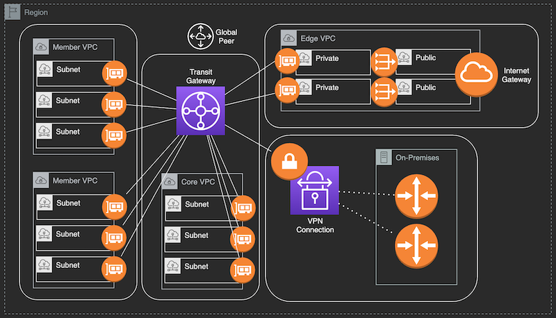
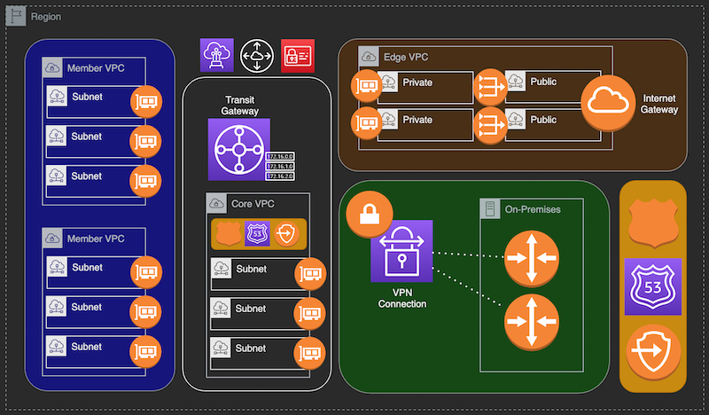
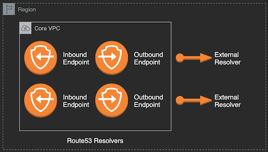
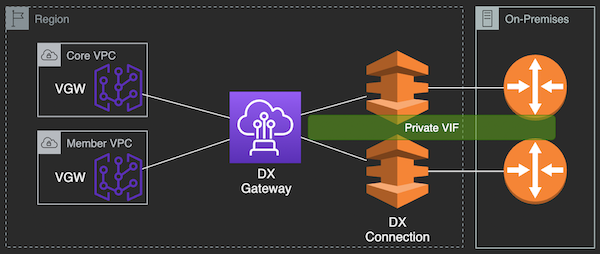
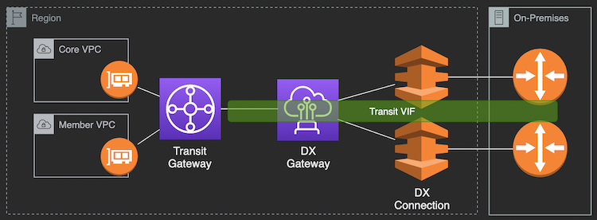

# Network Resources - Terraform Deployment

## Network Topology

#
## Individual Resource Stacks
- Core Router
  * `coreRouter.tf` - includes TGW, TGW Route tables, SSM Parameter
- Core VPC
  * `coreVpc.tf` - includes VPC, Subnets, Route tables, RT & TGW attachments
- Member VPC
  * `memberVpc.tf` - includes VPC, Subnets, Route tables & routes, TGW Attachments
- Edge VPC
  * `edgeVpc.tf` - includes VPC, Subnets, Route tables, RT & TGW attachments
  * `edgeGw.tf` - includes IGW, NAT gateways, and routes
- VPN Connection
  * `vpnConnection.tf` - includes CGW, VPN Connections, and TGW attachments
- Route53 Resolvers
  * `rt53resolvers.tf` - includes Rt53 PHZs, Inbound Endpoints, Outbound Endpoints, Resolver Rules
- VPC Endpoints
  * `vpcEndpoints.tf` - includes VPC gateway and interface endpoints
- Security Groups
  * `securityGroups.tf` - includes Security Groups used by other stacks

#
## Network components
- VPC (Core & Member)
- Subnets (Public, Private, Shared)
- Transit Gateway
- Internet Gateway
- NAT Gateway
- VPN Connection
- Direct Connect

#
## Deployment commands

1. `terraform init` - to initiate Terraform in the directory
2. `terraform validate` - validate configuration
3. `terraform plan` - show changes required by the configuration
4. `terraform apply` - deploy configured resources
5. `terraform destroy` - delete all resources in state

#
## Terraform Variables

Variable | Value | Description
------------ | ------------- | -------------
region | us-east-1 | Region for deployment
regionAsn | 64512-65534 | Regional Autonomous System Number (ASN) for transit gateway
regionCidr | X.X.X.X/X | CIDR Block for core router (TGW)
coreCidr | X.X.X.X/X | CIDR Block for core vpc
edgeCidr | X.X.X.X/X | CIDR Block for edge vpc 
coreSubnets | name: x.x.x.x/x | Map of CIDR blocks for core vpc subnets
edgeSubnets | name: x.x.x.x/x | Map of CIDR blocks for edge vpc subnets
memberVpc | key: value | Map of parameters for Member VPCs and subnets
vpnConnections | key: value | Map of parameters for VPN connections
rt53resolvers | key: value | Map of parameters for Route 53 resolvers and targets

#
## Variable Maps

vpnConnections:
- ASN & Endpoint IP address for Primary Customer Gateway
- ASN & Endpoint IP address for Secondary Customer Gateway

rt53resolvers:
- Inbound endpoint IP assignments (resolverIp)
- Outbound endpoint IP assignments (forwarderIp)
- Target IP addresses for query forwarding (targetIp)

#
## Route 53 Resolvers and Zones

### Individual Resources
- Route53 Resolver Inbound Endpoint
- Route53 Resolver Outbound Endpoint
- Route53 Resolver Rules
- Route53 Private Hosted Zone (PHZ)

Rt53 Resolver Inbound Endpoint
- VPC attached group of IP Addresses (min. 2) used for recieving DNS queries
- Resolve all zones associated with attached VPC

Rt53 Resolver Outbound Endpoint
- VPC hosted group of IP Addresses (min. 2) used for sending DNS queries
- Originate DNS queries to target IP addresses based on associated rule

Rt53 Resolver Rules
- Associated with multiple VPCs to properly resolve DNS queries
- Include target IP addresses that are privately connected to the VPC networks
- Types include conditional forwarder and system rule for hosted zones

Rt53 Private Hosted Zone (PHZ)  
- Private zones host DNS records for internal resolution
- Associated with multiple VPCs in multiple Regions (if necessary)
- Global resources

#
## VPC Endpoints

VPC endpoints provide private access to AWS services. 

- Gateway endpoints: S3, DynamoDB
- Interface endpoints: EC2, Lambda, ECR-API, ECR-DKR (Docker), ECS, RDS, 
  CodeCommit, CodeBuild, CodePipeline, CloudFormation, KMS, SSM, Logs

#
# Direct Connect

[AWS Knowledge Center - Which Virtual Interface](https://aws.amazon.com/premiumsupport/knowledge-center/public-private-interface-dx/)

## Private Virtual Interface Integration

Private Virtual Interfaces connect VPC resources with on-premises networks via Direct Connect.  
Multiple VPC connectivity requires:
- Direct Connect Gateway to aggregate DX connections
- For each VPC connection, a virtual gateway is required
  
## Transit Virtual Interface Integration

  
Transit Virtual Interfaces connect Transit Gateway resources with on-premises networks via Direct Connect.
* Requires 1Gbps or larger DX connection
* DXGW and TGW must use different ASNs